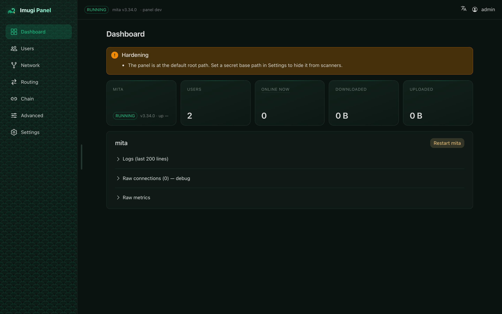
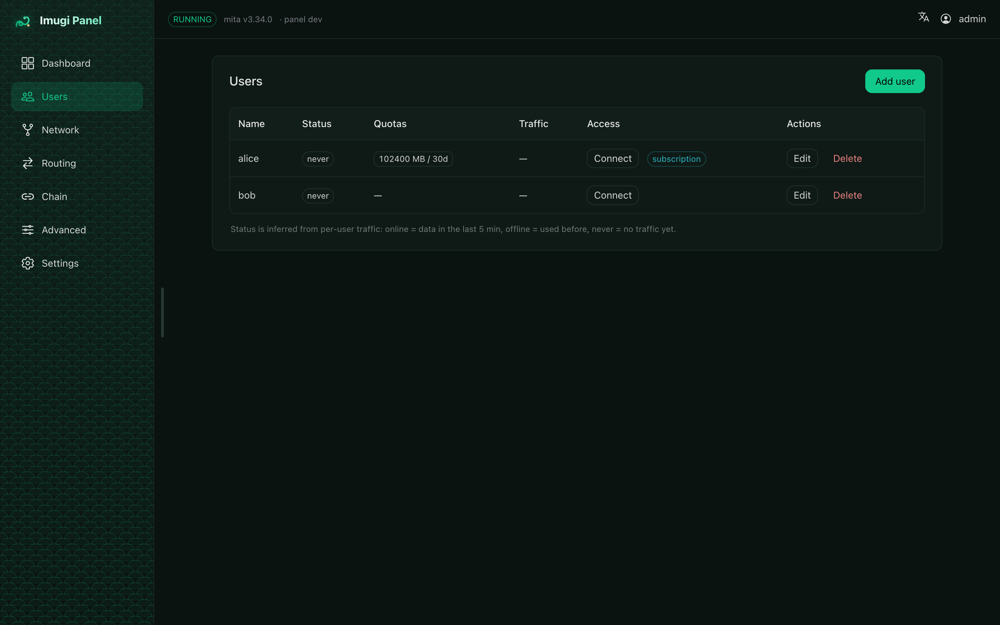
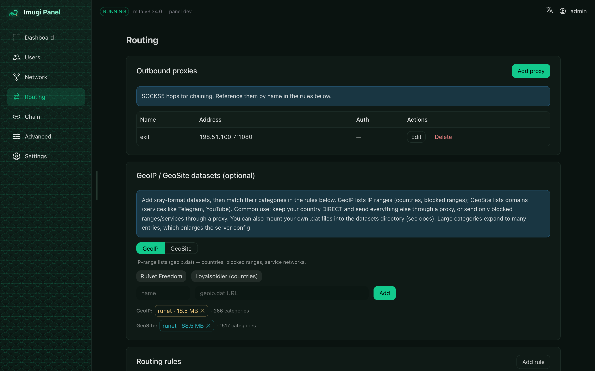
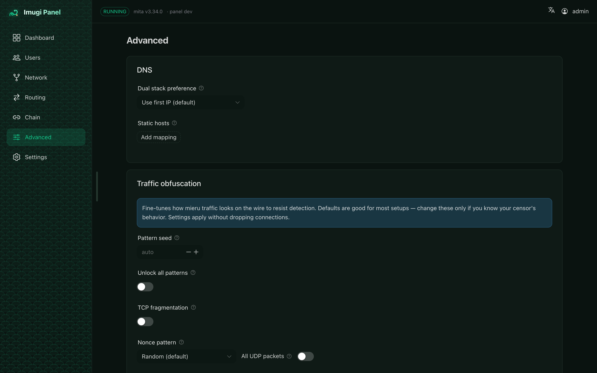
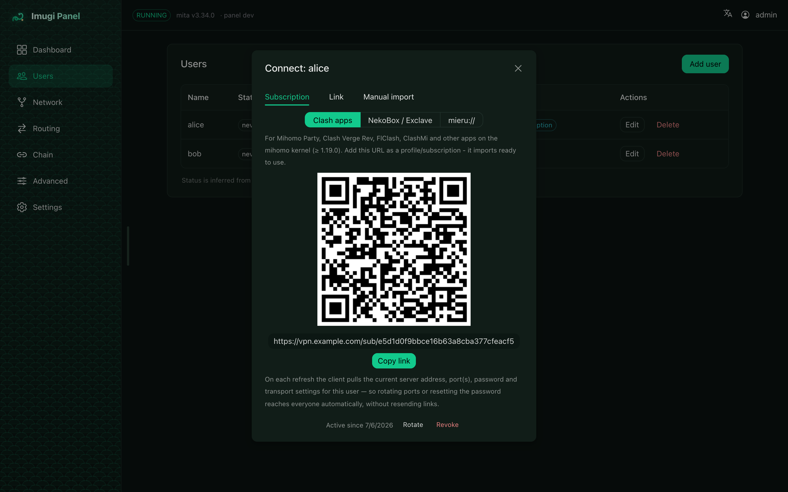
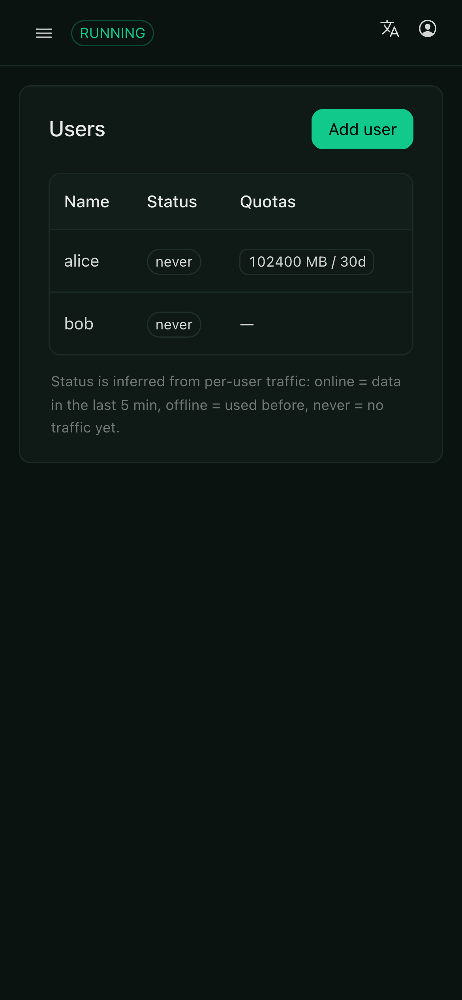

# Imugi Panel

[](https://github.com/fjcrux/mieru-web-ui/actions/workflows/ci.yml)
[](LICENSE)

**Imugi Panel** is a web admin panel for the
[mieru](https://github.com/enfein/mieru) proxy server (`mita`), in the spirit of
3x-ui for Xray. Manage users, ports, routing, and share links from the browser.
English and Russian UI.

Single Go binary with the Vue SPA embedded, shipped as one Docker image that
bundles and supervises `mita`.



<p align="center">
  
  
  
  
</p>

<p align="center">
  
</p>

<p align="center"><sub>English &amp; Russian · responsive down to phones</sub></p>

## Features

- **Users & quotas** - CRUD mieru users, traffic quotas, private-IP toggle.
- **Network** - port bindings (single ports and ranges, TCP/UDP), MTU, logging.
- **Dashboard** - mita status, live sessions, traffic, logs; restart from the UI.
- **Sharing** - per-user `mieru://` / `mierus://` links, QR codes, and expiring
  tokenized links on a separate path. See [sharing](docs/guides/sharing-configs.md).
- **Outbound routing & GeoIP** - SOCKS5 outbounds and rules by domain, CIDR, or
  GeoIP category (xray `geoip.dat`). See [routing](docs/guides/geoip-routing.md).
- **Panel chaining** - route egress through another panel with a pasted key.
  See [chaining](docs/guides/chaining-panels.md).
- **Advanced mieru tuning** - traffic obfuscation (fragmentation, nonce,
  padding), DNS dual-stack preference and static hosts, mandatory user hint.
  Every field has an explanatory tooltip.
- **Metrics** - OpenTelemetry (OTLP / Prometheus). See [metrics](docs/guides/metrics.md).
- **Hardening** - TLS, secret base path, Host validation, rate-limited login,
  crawler blocking (`robots.txt` + `X-Robots-Tag`).
  See [hardening](docs/guides/hardening.md).
- **Localization** - English and Russian out of the box; add a language by
  dropping a JSON file into [`web/src/locales`](web/src/locales/)
  (contributions welcome).

## Quick start (Docker)

```bash
git clone https://github.com/fjcrux/mieru-web-ui
cd mieru-web-ui
cp .env.example .env        # edit as needed
docker compose up -d        # pulls ghcr.io/fjcrux/imugi-panel:latest
docker compose logs | grep -A4 "Panel admin"   # generated password on first run
```

To build from source instead:

```bash
docker compose -f docker-compose.yml -f docker-compose.dev.yml up -d --build
```

The compose file publishes the panel on `127.0.0.1:8686` and the proxy ports in
bridge mode. Reach the panel via an SSH tunnel (or a
[reverse proxy](docs/guides/reverse-proxy-tls.md)):

```bash
ssh -L 8686:127.0.0.1:8686 user@your-server   # then open http://localhost:8686
```

For a production setup with a domain, use the bundled nginx compose instead —
it terminates TLS in a dockerized nginx on the same network and never exposes
the panel port itself:

```bash
docker compose -f docker-compose.nginx.yml up -d   # see the reverse-proxy guide
```

First login is `admin` with the printed password. Change it under **Settings**.

### First-time setup

1. **Settings**: set the Public host (address clients connect to) and, behind a
   proxy, the Panel URL.
2. **Network**: add a port binding (open it in your firewall / `PROXY_PORTS`).
3. **Users**: add a user; the proxy starts once there's a user and a port.
4. **Users → Share**: hand out the link or QR.

## Client apps

Users connect with any mieru-capable client: open the **Share** dialog, then
import the `mieru://` / `mierus://` link or scan the QR. Recommended apps:

- **Android** — [NekoBox](https://github.com/MatsuriDayo/NekoBoxForAndroid) (+ [mieru plugin](https://github.com/enfein/NekoBoxPlugins)), [Exclave](https://github.com/dyhkwong/Exclave), [Karing](https://karing.app/), or [ClashMi](https://clashmi.app/)
- **iOS** — [Shadowrocket](https://apps.apple.com/app/id932747118), [Karing](https://karing.app/), or [ClashMi](https://clashmi.app/)
- **Windows / macOS / Linux** — [Mihomo Party](https://mihomo.party/), [Clash Verge Rev](https://www.clashverge.dev/), or the official [mieru CLI](https://github.com/enfein/mieru/blob/main/docs/client-install.md)

mieru maintains the [full, up-to-date client list](https://github.com/enfein/mieru#third-party-client-software).

For Clash-family apps (Mihomo Party, Clash Verge Rev, FlClash, ClashMi — anything on mihomo ≥ 1.19.0), the **Subscription** tab in the Share dialog issues a permanent URL that serves a ready-to-import Clash profile and auto-refreshes in the client. The same URL with `?format=mierus` or `?format=mieru` returns the native links as a base64 line list for URI-subscription clients (NekoBox/Exclave with the mieru plugin), and `?flavor=proxies` returns a proxies-only document for `proxy-provider` setups.

## Configuration

All options live in `.env` - see [`.env.example`](.env.example) for the full,
commented list (ports, admin, TLS, panel URL, base path, share path, GeoIP,
metrics). `docker compose` reads `.env` automatically.

For local compose tweaks (extra networks, published ports, mounts, limits)
copy [`docker-compose.override.example.yml`](docker-compose.override.example.yml)
to `docker-compose.override.yml` — compose merges it automatically and it's
gitignored, so updates never conflict with your changes.

## How it works

See [docs/guides/how-it-works.md](docs/guides/how-it-works.md) for the mental
model: one container supervising mita (and any chained clients), ports driven by
a single `PROXY_PORTS`, and the admin/share paths.

## Guides

Task-oriented how-tos are in [docs/guides](docs/guides/): how it works,
TLS/reverse-proxy, hardening, routing & GeoIP, chaining panels, sharing, metrics.

## Updating mieru/mita

```bash
scripts/update-mieru.sh v3.35.0   # bumps go.mod, Dockerfiles, .env, compose
make test && make docker          # verify and rebuild
```

## Releases

Pushing a `vX.Y.Z` tag builds and publishes the image to
`ghcr.io/fjcrux/imugi-panel` (`X.Y.Z`, `X.Y`, `latest`) and creates a GitHub
Release. Nothing is published from branch pushes.

## Security

See [SECURITY.md](SECURITY.md). Key points: serve over TLS; the panel stores
mieru user passwords in plaintext (mode 0600) to build client configs, so
protect the `/data` volume; treat share links as secrets.

## Development

See [docs/DEVELOPMENT.md](docs/DEVELOPMENT.md).

## License

GPL-3.0 - Imugi Panel imports the GPL-3.0 `mieru` module. See [LICENSE](LICENSE).
